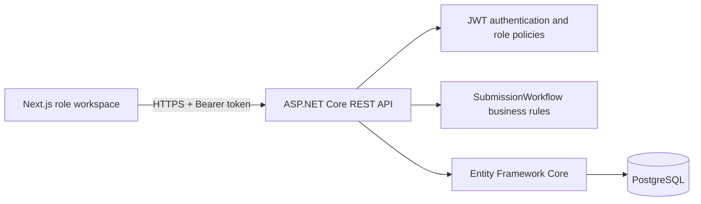
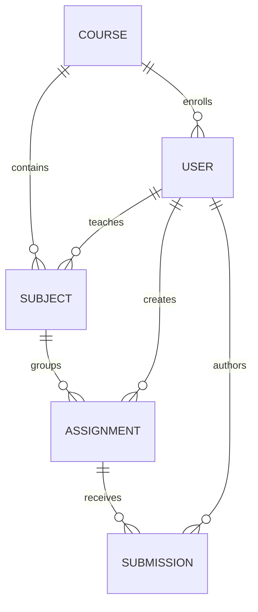
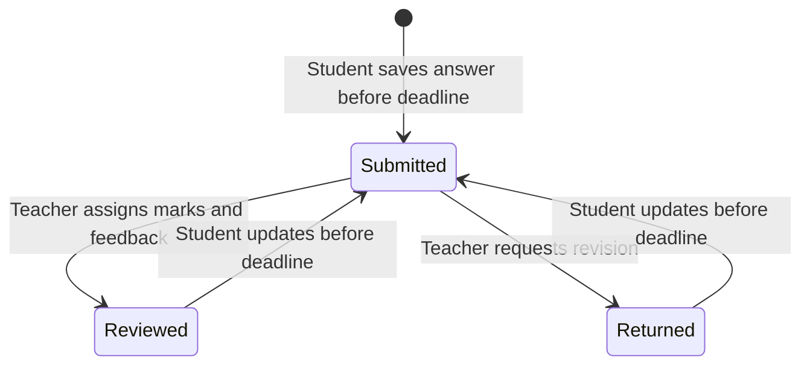

# Architecture and Request Flows

This application uses a client/server boundary intentionally: the Next.js client improves usability, while ASP.NET Core remains the authority for identity, roles, ownership, deadlines, and marks.

## System map

## Core data relationships

Important constraints:

- A student belongs to at most one course.
- Subject codes are unique within a course.
- A student has at most one submission per assignment.
- Teacher deletion of an assignment is blocked after submissions exist.
- Course/subject deletion is blocked while dependent academic records exist.

## Authorization matrix

| Capability                             | Admin | Teacher | Student |
| -------------------------------------- | :---: | :-----: | :-----: |
| Manage users/courses/subjects          |  Yes  |   No    |   No    |
| View all submissions                   |  Yes  |   No    |   No    |
| Create/update/delete owned assignments |  No   |   Yes   |   No    |
| Review owned-assignment submissions    |  No   |   Yes   |   No    |
| View published course assignments      |  No   |   No    |   Yes   |
| Submit/update before deadline          |  No   |   No    |   Yes   |
| View own marks and feedback            |  No   |   No    |   Yes   |

The API enforces this matrix. Hiding a UI control is never treated as authorization.

## Submission lifecycle

Updating an answer clears the previous marks, feedback, and review timestamp. This avoids displaying stale evaluation against changed work.

## Trust boundaries

1. Login returns a signed JWT containing the stable user identifier and role.
2. Controllers derive the user identifier from validated claims, never from request payloads.
3. Teacher queries are scoped to assignment ownership.
4. Student assignment access is scoped through the student's course.
5. Deadline and mark validation run on the server even when the browser already validates the form.
6. Logs contain identifiers and state transitions, not passwords or submission content.

## Design trade-offs

- Text answers keep the required workflow focused; file storage is deliberately outside scope.
- Browser token storage is acceptable for this evaluation demo but should become a secure HTTP-only cookie strategy in production.
- The UI favors a single role command center with anchored navigation over many shallow routes, keeping the evaluator tour fast while preserving feature-based source organization.
